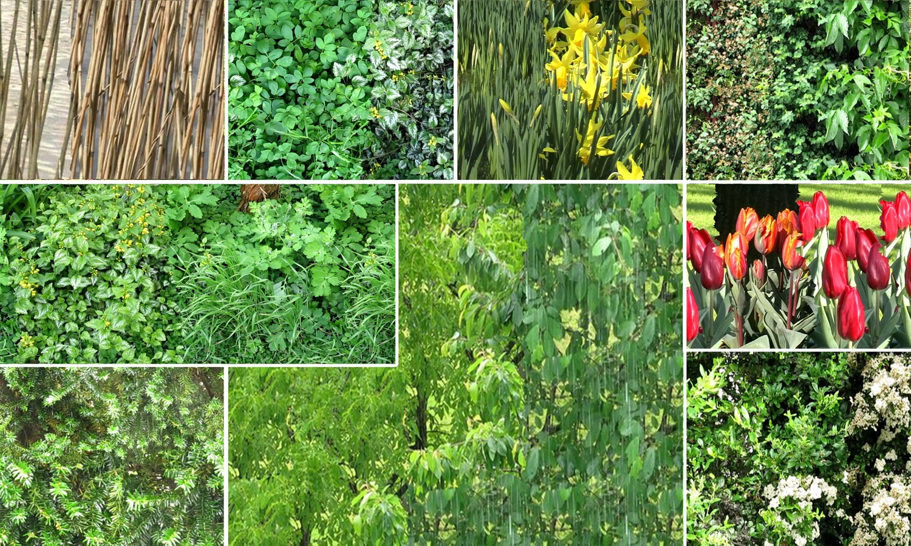

# Dynamic Texture Editing

**Mix, enlarge, and edit moving textures using reusable spatiotemporal patches.**

Research companion to **Radek Richtr and Michal Haindl**, *Dynamic Texture Editing*, Spring Conference on Computer Graphics (SCCG), 2015.

[Read the paper](https://library.utia.cas.cz/separaty/2016/RO/haindl-0452757.pdf) · [Publication and DOI](https://doi.org/10.1145/2788539.2788559) · [Earlier work: Dynamic Texture Enlargement](https://doi.org/10.1145/2508244.2508245)



*The original Figure 1 illustration, recovered at 2910 × 1748 pixels from a historical manuscript. This display preview is resized and JPEG-encoded for the web; the full native image is in [figures.zip](figures.zip). No generative enhancement was used.*

## The idea

The paper extends toroidal patch-based dynamic texture synthesis to editing and mixing. An analysis stage prepares patches and compatible boundaries; synthesis assembles the prepared material. The article explores colour toning, mixing different textures, temporal editing, and a video-editing example.

This repository presents the historical work. It does not claim new validation or an exact executable reproduction.

## Recovered illustrations

Nine image components have been matched visually to the published figures and recovered from the higher-resolution historical draft:

| Published location | Published raster | Recovered raster |
| --- | --- | --- |
| Figure 1 | 1040 × 625 | 2910 × 1748 |
| Figure 3, source texture | 200 × 160 | 360 × 288 |
| Figure 5, each component | 225 × 150 | 1500 × 1000 |
| Table 2, five examples | 185 × 185 or 196 × 196 | 610 × 610 |

Download [figures.zip](figures.zip) for the native images in its `assets/` folder. See [the image manifest](assets-manifest.json) and [RESTORATION.md](RESTORATION.md) for the mapping. These are recovered historical images, not newly generated results. Other figures in the draft differ from the publication and have not been substituted.

## Archive status

| Material | Current availability |
| --- | --- |
| Published article | Public institutional PDF linked above |
| Citation | `CITATION.cff` and `citation.bib` |
| Matched higher-resolution images | Nine components in [figures.zip](figures.zip) |
| Original LaTeX | Byte-preserved archival source in [`source/original/`](source/original/) |
| Typo-only source copy | [`source/edited/`](source/edited/) with an explicit change log |
| Verified historical videos | Four companions in [`media/`](media/) with [metadata and provenance](MEDIA.md) |
| Other archive candidates | Kept private until their figure mapping is resolved |
| Historical implementation | Not yet recovered |

The published paper has eight pages. A twelve-page local draft is a source of candidate images, not a replacement for the published text. The restored manuscript will be labelled separately and accompanied by a change log.

The archival source is kept separate from the recovered figures and videos. It
references historical class, image, and bibliography files that were not
recovered, so it is not presented as a self-contained build or as the exact
version of record. See [`source/original/SOURCE_INFO.md`](source/original/SOURCE_INFO.md).

For review, [`source/edited/`](source/edited/) contains a conservative typo-only
working copy and [`CHANGELOG.md`](source/edited/CHANGELOG.md). The original
source remains authoritative for provenance; no equation, number, citation
key, figure, table, or experimental claim was changed in the working copy.

## Citation

```bibtex
@inproceedings{RichtrHaindl2015DynamicTextureEditing,
  author = {Richtr, Radek and Haindl, Michal},
  title = {Dynamic Texture Editing},
  booktitle = {Proceedings of the 31st Spring Conference on Computer Graphics},
  year = {2015},
  pages = {133--140},
  publisher = {Association for Computing Machinery},
  doi = {10.1145/2788539.2788559},
  url = {https://doi.org/10.1145/2788539.2788559}
}
```

## Rights and provenance

Article and image rights remain with the respective rights holders. This recovery does not grant a new blanket licence over the article or third-party data. Cite the original work when referring to its method or figures. The publisher PDF is linked rather than redistributed as an altered version of record.
